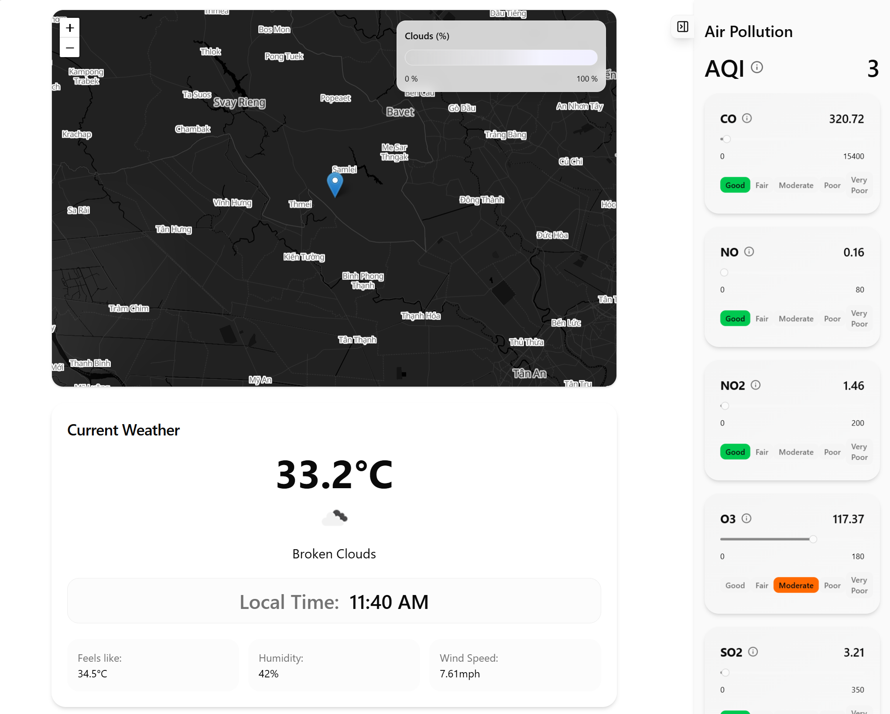
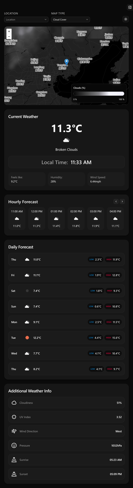
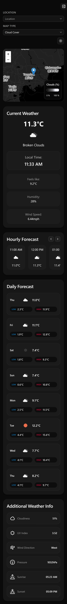

# WeatherMap

WeatherMap is a weather dashboard built with React, TypeScript, and Vite. It shows current weather, hourly forecast, daily forecast, additional weather details, air pollution data, and interactive weather map layers.

## Preview

### Desktop



### Tablet



### Mobile



## Features

- Current weather overview
- Hourly forecast with horizontal scrolling
- Daily forecast with low and high temperatures
- Additional weather metrics such as humidity, pressure, UV index, and wind direction
- Air pollution side panel with AQI and pollutant details
- Interactive map with selectable weather layers
- Dark and light mode
- Responsive layout for mobile, tablet, and desktop

## Tech Stack

- React
- TypeScript
- Vite
- Tailwind CSS v4
- TanStack Query
- Leaflet / React Leaflet
- Axios
- Zod
- Lucide React

## Getting Started

Install dependencies:

```bash
npm install
```

Create a local environment file:

```dotenv
VITE_API_KEY=YOUR_OPENWEATHER_API_KEY
```

Start the development server:

```bash
npm run dev
```

Build for production:

```bash
npm run build
```

Preview the production build:

```bash
npm run preview
```

## Scripts

- `npm run dev` starts the Vite dev server
- `npm run build` builds the app for production
- `npm run preview` previews the production build
- `npm run lint` runs ESLint

## Project Structure

```text
src/
  components/
    app/
    dropdown/
    map/
    sidePanel/
    skeletons/
    ui/
    weatherInfo/
  hooks/
  lib/
  schemas/
```

## Public Assets

The `public` folder also contains SVG assets used by the UI:

- `pressure.svg`
- `sunrise.svg`
- `sunset.svg`
- `uv_index.svg`
- `wind_direction.svg`

## Notes

- This project uses OpenWeather APIs, so you need a valid API key.
- Variables prefixed with `VITE_` are exposed to the frontend. Do not treat them as secret in a public deployment.
- If you want to protect your API key, move the OpenWeather requests behind a backend or proxy.
